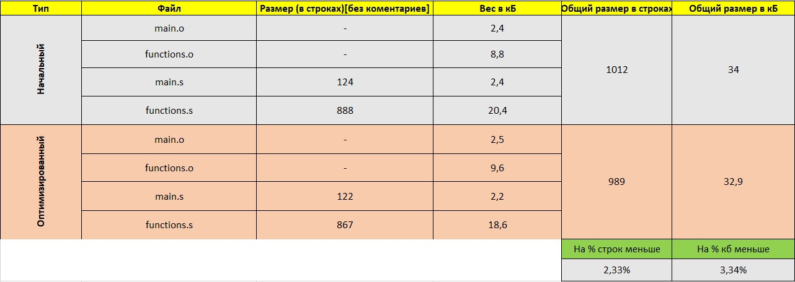
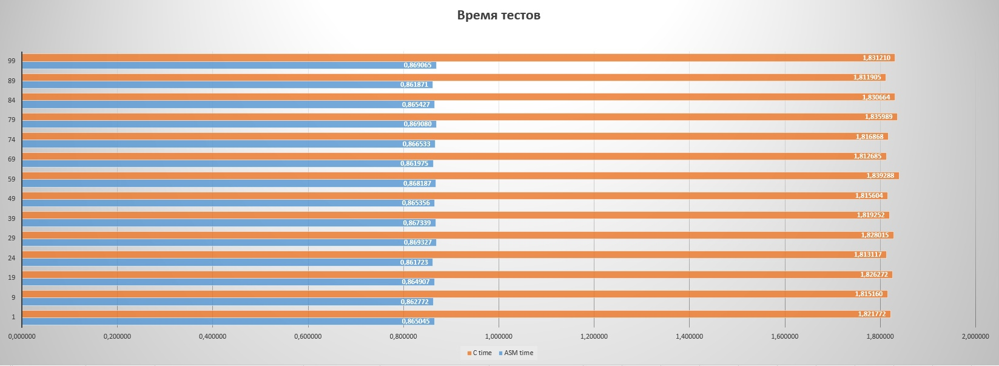
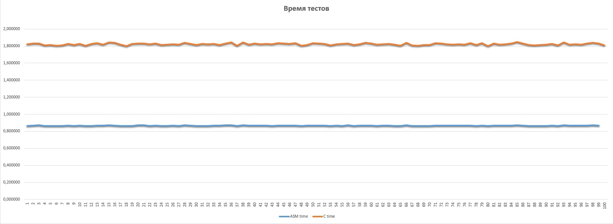

# Отчёт. Домашнее задание 3. Вариант 25.
## _Шарапов Егор Сергеевич, БПИ219_

В данном отчете представлены действия, проделанные для работы.
> Рекомендую открыть всю папку как проект в **VScode** или **Atom** и удобно и быстро прыгать по ссылкам на файлы из отчета.

*В работе выполнены требования на 8.*

## Условие

>Разработать программу, решающую вопрос о принадлежности заданных 4-х точек одной окружности.

## Содержание 
- [Начало](#отчёт-домашнее-задание-3-вариант-25)
- [Условие](#условие)
- [Описание решения](#описание-решения)
- [Код на С](#исходный-код-на-с)
- [Первое ассемблирование](#первое-ассемблирование-кода-на-с)
- [Второе ассемблирование](#второе-ассемблирование)
- [Анализ](#анализ)
- [Завершение](#конец-отчета)


## Описание решения
# 
В програме реализовано три типа работы:
>Ввод\вывод в консоли
```sh
$ ./main_optimized 
Начинаем работу в консольном режиме!
Введите число повторений программы (от 1 до 9223372036854775000): 100000
--Точка 1----------------------------
Введите координату x точки [1]: 1.2
Введите координату y точки [1]: 1.2
--Точка 2----------------------------
Введите координату x точки [2]: -1.2
Введите координату y точки [2]: -1.2
--Точка 3----------------------------
Введите координату x точки [3]: 1.2
Введите координату y точки [3]: -1.2
--Точка 4----------------------------
Введите координату x точки [4]: -1.2
Введите координату y точки [4]: 1.2

---------------------
Введенные данные: 
Точка 1:( x = 1.200000, y = 1.200000 )
Точка 2:( x = -1.200000, y = -1.200000 )
Точка 3:( x = 1.200000, y = -1.200000 )
Точка 4:( x = -1.200000, y = 1.200000 )
Число повторений кода: 100000
--------------------
Время исполнения программы: 0.007132
- Точки принадлежат окружности
```
> Работа с файлами ввода (содержащего колличество потворений и данные по точкам) и файлом вывода

```sh
$ ./main_optimized in.txt out.txt 
Производим cчитывание из файлов!

---------------------
Введенные данные: 
Точка 1:( x = 3.200000, y = 3.200000 )
Точка 2:( x = -3.200000, y = -3.200000 )
Точка 3:( x = 3.200000, y = -3.200000 )
Точка 4:( x = -3.200000, y = 3.200000 )
Число повторений кода: 100000000
--------------------
Время исполнения программы: 0.874620
Ответ в файле вывода!
--------------------
```

>Генерация данных c заданным колличеством повторений и запись ответа в файл вывода

```sh
./main_optimized -g 1000 out.txt 
Производим генерацию!

---------------------
Введенные данные: 
Точка 1:( x = 12964.010561, y = 14827.361291 )
Точка 2:( x = 14511.038768, y = 10393.745711 )
Точка 3:( x = 15821.824986, y = 6946.589331 )
Точка 4:( x = 824.704039, y = 6424.619740 )
Число повторений кода: 1000
--------------------
Время исполнения программы: 0.000078
Ответ в файле вывода!
--------------------
```
# Исходный код на С

[main.c](./%D0%A1_files/main.c)

```sh
#include <stdio.h>
#include <stdlib.h>
#include <time.h>
#include "functions.h"

int main(int argc, char **argv)
{
    char *e;
    double points[8];
    long long num_of_rep = 0;

    int choice = get_type_of_work(argc, argv);
    if (choice == 0)
    {
        num_of_rep = get_number_or_repeats(choice, argv);
        get_points(points);
    }
    else if (choice == 1)
    {
        num_of_rep = get_number_or_repeats(choice, argv);
        get_points_file(points, argv);
    }
    else if (choice == 2)
    {
        generate_points(points);
        num_of_rep = strtol(argv[2], &e, 10);
    }
    else
    {
        puts("Произошла ошибка исполнения!\n");
        return 0;
    }
    print_input(points, num_of_rep);
    check_points(points, choice, argv, num_of_rep);
    return 0;
}
```

[functions.c](./%D0%A1_files/functions.c)

```sh
#include <stdio.h>
#include <stdlib.h>
#include <time.h>

void get_points(double points[])
{
    int n = 1;
    for (int i = 1; i < 9; ++i)
    {
        if (i % 2 != 0)
        {
            printf("--Точка %d----------------------------\n", n);
            printf("Введите координату x точки [%d]: ", n);
            scanf("%lf", &points[i - 1]);
        }
        else
        {
            printf("Введите координату y точки [%d]: ", n++);
            scanf("%lf", &points[i - 1]);
        }
    }
}

void generate_points(double points[])
{
    srand(time(0));
    for (size_t i = 0; i < 8; i++)
    {
        points[i] = ((double)rand() * (16000.00 - 0.001)) / (double)RAND_MAX + 0.001;
    }
}

void get_points_file(double points[], char **argv)
{
    FILE *f = fopen(argv[1], "r");
    int i = 0;
    double num = 0;
    while (fscanf(f, "%lf ", &num) > 0 && i < 8)
    {
        points[i++] = num;
    }
    fclose(f);
}

int get_type_of_work(int argc, char **argv)
{
    if (argc == 4)
    {
        puts("Производим генерацию!");
        FILE *fo = fopen(argv[3], "rb+");
        if (!fo)
        {
            puts("Внимание: Файл вывода не обнаружен или недоступен! Он будет создан.");
        }
        else
        {
            fclose(fo);
        }
        return 2;
    }
    else if (argc == 3)
    {
        puts("Производим cчитывание из файлов!");
        FILE *f = fopen(argv[1], "rb+");
        if (!f)
        {
            puts("Файл ввода не обнаружен или недоступен!");
            return -1;
        }
        fclose(f);
        FILE *fo = fopen(argv[2], "rb+");
        if (!fo)
        {
            puts("Внимание: Файл вывода не обнаружен или недоступен! Он будет создан.");
        }
        else
        {
            fclose(fo);
        }
        return 1;
    }
    else if (argc == 1)
    {
        puts("Начинаем работу в консольном режиме!");
        return 0;
    }
    else
    {
        puts("Неверное количество параметров, их всегда 4 - и файлы [-g] (генерация) или 2 - входной и выходной файл");
        return -1;
    }
}

void print_input(double points[], long long num_of_rep)
{
    printf("\n---------------------\nВведенные данные: \n");
    int n = 1;
    for (int i = 0; i < 8; i += 2)
    {
        printf("Точка %d:( x = %lf, y = %lf )\n", n, points[i], points[i + 1]);
        n++;
    }
    printf("Число повторений кода: %lld\n", num_of_rep);
    printf("--------------------\n");
}

int is_in_circle(double points[])
{
    double x_1 = points[0];
    double x_2 = points[2];
    double x_3 = points[4];
    double x_4 = points[6];
    double y_1 = points[1];
    double y_2 = points[3];
    double y_3 = points[5];
    double y_4 = points[7];
    double check = x_2 * x_2 * (x_4 * (y_3 - y_1) + x_3 * (y_1 - y_4) + x_1 * (y_4 - y_3)) + x_2 * (x_3 * x_3 * (y_4 - y_1) + x_4 * x_4 * (y_1 - y_3) + (y_3 - y_4) * (x_1 * x_1 + (y_1 - y_3) * (y_1 - y_4))) + (y_2 - y_3) * (-1 * x_1 * (x_4 * x_4 + (y_2 - y_4) * (y_3 - y_4)) + x_4 * (y_1 - y_2) * (y_1 - y_3) + x_4 * x_1 * x_1) + x_3 * x_3 * (x_4 * (y_1 - y_2) + x_1 * (y_2 - y_4)) + x_3 * (x_4 * x_4 * (y_2 - y_1) - (y_2 - y_4) * (x_1 * x_1 + (y_1 - y_2) * (y_1 - y_4)));
    if ((check) == 0)
    {
        return 1;
    }
    else
    {
        return 0;
    }
}

void check_points(double points[], int choice, char **argv, long long num_of_rep)
{
    int answer = 0;
    clock_t begin = clock();
    for (long long i = 0; i < num_of_rep; i++)
    {
        answer = is_in_circle(points);
    }
    clock_t end = clock();
    double time_spent = (double)(end - begin) / CLOCKS_PER_SEC;
    printf("Время исполнения программы: %f\n", time_spent);
    if (choice == 1)
    {
        printf("Ответ в файле вывода!\n");
        FILE *f = fopen(argv[2], "w+");
        if (answer)
        {
            fprintf(f, "- Точки принадлежат окружности\n");
        }
        else
        {
            fprintf(f, "- Точки не принадлежат окружности\n");
        }
        fclose(f);
    }
    else if (choice == 2)
    {
        printf("Ответ в файле вывода!\n");
        FILE *f = fopen(argv[3], "w+");
        if (answer)
        {
            fprintf(f, "- Точки принадлежат окружности\n");
        }
        else
        {
            fprintf(f, "- Точки не принадлежат окружности\n");
        }
        fclose(f);
    }
    else
    {
        if (answer)
        {
            printf("- Точки принадлежат окружности\n");
        }
        else
        {
            printf("- Точки не принадлежат окружности\n");
        }
    }
    printf("--------------------\n");
}

long long get_number_or_repeats(int choice, char **argv)
{
    long long num = 0;
    if (choice == 1)
    {
        FILE *f = fopen(argv[1], "r");
        int i = 0;
        double n = 0;
        while (fscanf(f, "%lf ", &n) > 0 && i < 8)
        {
        }
        fscanf(f, ":%lld", &num);
        fclose(f);
    }
    else
    {
        while (num <= 0 || num >= 9223372036854775000)
        {
            printf("Введите число повторений программы (от 1 до 9223372036854775000): ");
            scanf("%lld", &num);
        }
    }
    return num;
}
```

Программа была откомпилированна без оптимизирующих и отладочных функций 
```sh
$gcc -c main.c functions.c
$gcc main.o functions.o -o main_not_optimized_first
```
[**Файлы**](./Compiled/)

- [main_not_optimized_first](./Compiled/main_not_optimized_first)

Запущена и протестирована:


**Test 1**
```sh
3.2 3.2 -3.2 -3.2 3.2 -3.2 -3.2 3.2 :100000000
```
**Ответ**
```sh
- Точки принадлежат окружности
```

**Test 2**
```sh
3.3 3.3 -3.3 -3.3 3.3 -3.3 -3.3 3.3 :100000000
```
**Ответ**
```sh
- Точки принадлежат окружности
```

**Test 3**
```sh
3.332 3.332 -3.332 -3.332 3.332 -3.332 -3.332 3.332 :100000000
```
**Ответ**
```sh
- Точки принадлежат окружности
```

**Test 4**
```sh
3.1234 3.1234 -3.1234 -3.1234 3.1234 -3.1234 -3.1234 3.1234 :100000000
```
**Ответ**
```sh
- Точки принадлежат окружности
```

**Test 5**
```sh
3.123 34.1 341.1 234.2 2.1 2.3 3.21 4.55 :1000000
```
**Ответ**
```sh
- Точки не принадлежат окружности
```

**Test 6**
```sh
123.11 2.332121 4567.543 223.123 213.211 2.1 23.4 22.1 :10000000
```
**Ответ**
```sh
- Точки не принадлежат окружности
```

**Test 7**
```sh
3.123 4.456 -3.123 -4.456 3.123 -4.456 -3.123 4.456 :100000000
```
**Ответ**
```sh
- Точки принадлежат окружности
```

**Test 8**
```sh
1 1 -1 -1 1 -1 -1 1 :10000000
```
**Ответ**
```sh
- Точки принадлежат окружности
```

**Test 9**
```sh
233 44433 2332 2322 332 22 332 111 :100000000
```
**Ответ**
```sh
- Точки не принадлежат окружности
```

**Test 10**
```sh
1000 1000 -1000 -1000 1000 -1000 -1000 1000 :10
```
**Ответ**
```sh
- Точки принадлежат окружности
```

**Test 11**
```sh
-1.12 -1.12 1.12 1.12 -1.12 1.12 1.12 -1.12 :8000
```
**Ответ**
```sh
- Точки принадлежат окружности
```

# Первое ассемблирование кода на С
Программа была ассемблирована без оптимизирующих опций c использованием makefile (бывало консоли)

```sh
$gcc -O0 -S -masm=intel main.c functions.c
```

[**Файлы**](./S-files/From_C/)

- [main.s](./S-files/From_C/main.s)
- [functions.s](./S-files/From_C/functions.s)

В файлы были добавленны коменарии с пояснениями.

После этого были получены обьектные файлы **.o**.

```sh
$as main.s main.o
$as functions.s functions.o
```

[**Файлы**](./O_files/S-code/)

- [main.o](./O_files/S-code/main.o)
- [functions.o](./O_files/S-code/functions.o)

Был получен исполняемый файл из первых **.o** файлов.
```sh
$gcc main.o functions.o -o main_not_optimized_second
```
[**Файлы**](./Compiled/)

- [main_not_optimized_second](./Compiled/main_not_optimized_second)

Полученный исполняемый файл был протестирован

**Test 1**
```sh
3.2 3.2 -3.2 -3.2 3.2 -3.2 -3.2 3.2 :100000000
```
**Ответ**
```sh
- Точки принадлежат окружности
```

**Test 2**
```sh
3.3 3.3 -3.3 -3.3 3.3 -3.3 -3.3 3.3 :100000000
```
**Ответ**
```sh
- Точки принадлежат окружности
```

**Test 3**
```sh
3.332 3.332 -3.332 -3.332 3.332 -3.332 -3.332 3.332 :100000000
```
**Ответ**
```sh
- Точки принадлежат окружности
```

**Test 4**
```sh
3.1234 3.1234 -3.1234 -3.1234 3.1234 -3.1234 -3.1234 3.1234 :100000000
```
**Ответ**
```sh
- Точки принадлежат окружности
```

**Test 5**
```sh
3.123 34.1 341.1 234.2 2.1 2.3 3.21 4.55 :1000000
```
**Ответ**
```sh
- Точки не принадлежат окружности
```

**Test 6**
```sh
123.11 2.332121 4567.543 223.123 213.211 2.1 23.4 22.1 :10000000
```
**Ответ**
```sh
- Точки не принадлежат окружности
```

**Test 7**
```sh
3.123 4.456 -3.123 -4.456 3.123 -4.456 -3.123 4.456 :100000000
```
**Ответ**
```sh
- Точки принадлежат окружности
```

**Test 8**
```sh
1 1 -1 -1 1 -1 -1 1 :10000000
```
**Ответ**
```sh
- Точки принадлежат окружности
```

**Test 9**
```sh
233 44433 2332 2322 332 22 332 111 :100000000
```
**Ответ**
```sh
- Точки не принадлежат окружности
```

**Test 10**
```sh
1000 1000 -1000 -1000 1000 -1000 -1000 1000 :10
```
**Ответ**
```sh
- Точки принадлежат окружности
```

**Test 11**
```sh
-1.12 -1.12 1.12 1.12 -1.12 1.12 1.12 -1.12 :8000
```
**Ответ**
```sh
- Точки принадлежат окружности
```

> Результаты тестов совпадают с прошлой компиляцией.

# Второе ассемблирование

Было решено облегчить себе задачу отпимизации и выбрать парочку опций, чтобы облегчить дальнейший рефакторинг.\
Первый раз не будем использовать опции **-fmove-loop-invariants** они прекращают нормальную работу повторений кода из-за извлечения подсчетов из циклов, так как компилятор понимает, что компьютер будет производить лишние вычисления.

Флаги будем применять с помощью самописного [**makefile**](./%D0%A1_files/makefile_Omanual_opt.mk)
```sh
-fauto-inc-dec
-fbranch-count-reg
-fcombine-stack-adjustments
-fcompare-elim
-fcprop-registers
-fdce
-fdefer-pop
-fdelayed-branch
-fdse
-fforward-propagate
-fguess-branch-probability
-fif-conversion
-fif-conversion2
-finline-functions-called-once
-fipa-modref
-fipa-profile
-fipa-pure-const
-fipa-reference
-fipa-reference-addressable
-fmerge-constants
-fomit-frame-pointer
-freorder-blocks
-fshrink-wrap
-fshrink-wrap-separate
-fsplit-wide-types
-fssa-backprop
-fssa-phiopt
-ftree-bit-ccp
-ftree-ccp
-ftree-ch
-ftree-coalesce-vars
-ftree-copy-prop
-ftree-dce
-ftree-dominator-opts
-ftree-dse
-ftree-forwprop
-ftree-fre
-ftree-phiprop
-ftree-pta
-ftree-scev-cprop
-ftree-sink
-ftree-slsr
-ftree-sra
-ftree-ter
-funit-at-a-time
-falign-functions -falign-jumps
-falign-labels -falign-loops
-fcaller-saves
-fcode-hoisting
-fcrossjumping
-fcse-follow-jumps -fcse-skip-blocks
-fdelete-null-pointer-checks
-fdevirtualize -fdevirtualize-speculatively
-fexpensive-optimizations
-ffinite-loops
-fgcse -fgcse-lm
-fhoist-adjacent-loads
-finline-functions
-finline-small-functions
-findirect-inlining
-fipa-bit-cp -fipa-cp -fipa-icf
-fipa-ra -fipa-sra -fipa-vrp
-fisolate-erroneous-paths-dereference
-flra-remat
-foptimize-sibling-calls
-foptimize-strlen
-fpartial-inlining
-fpeephole2
-freorder-blocks-algorithm=stc
-freorder-blocks-and-partition -freorder-functions
-frerun-cse-after-loop
-fschedule-insns -fschedule-insns2
-fsched-interblock -fsched-spec
-fstore-merging
-fstrict-aliasing
-fthread-jumps
-ftree-builtin-call-dce
-ftree-loop-vectorize
-ftree-pre
-ftree-slp-vectorize
-ftree-switch-conversion -ftree-tail-merge
-ftree-vrp
-fvect-cost-model=very-cheap
-masm=intel
-fverbose-asm 
-save-temps
```


Сразу получены файлы **.s**.

[**Файлы**](./S-files/Optimizated/)
- [main.s](./S-files/Optimizated/main.s)
- [functions.s](./S-files/Optimizated/functions.s)

Ассемблерные файлы были зарефакторены (убраны лишние макросы, большинство переменных переведены в регистры)

В файлы [**main.s**](./S-files/Optimizated/main.s) и [**functions.s**](./S-files/Optimizated/functions.s) были добавлены все поясняющие коментарии.


Получены файлы **.o**.

```sh
$as main.s -o main.o
$as functions.s -o functions.o
```

[**Файлы**](./O_files/S-code-optimized/)
- [main.o](./O_files/S-code-optimized/main.o)
- [functions.o](./O_files/S-code-optimized/functions.o)


Был получен исполняемый файл из вторых **.o** файлов.
```sh
$gcc main.o functions.o -o main_optimized
```


[**Файлы**](./Compiled/)

- [main_optimized](./Compiled/main_optimized)

Полученный исполняемый файл был протестирован.

**Test 1**
```sh
3.2 3.2 -3.2 -3.2 3.2 -3.2 -3.2 3.2 :100000000
```
**Ответ**
```sh
- Точки принадлежат окружности
```

**Test 2**
```sh
3.3 3.3 -3.3 -3.3 3.3 -3.3 -3.3 3.3 :100000000
```
**Ответ**
```sh
- Точки принадлежат окружности
```

**Test 3**
```sh
3.332 3.332 -3.332 -3.332 3.332 -3.332 -3.332 3.332 :100000000
```
**Ответ**
```sh
- Точки принадлежат окружности
```

**Test 4**
```sh
3.1234 3.1234 -3.1234 -3.1234 3.1234 -3.1234 -3.1234 3.1234 :100000000
```
**Ответ**
```sh
- Точки принадлежат окружности
```

**Test 5**
```sh
3.123 34.1 341.1 234.2 2.1 2.3 3.21 4.55 :1000000
```
**Ответ**
```sh
- Точки не принадлежат окружности
```

**Test 6**
```sh
123.11 2.332121 4567.543 223.123 213.211 2.1 23.4 22.1 :10000000
```
**Ответ**
```sh
- Точки не принадлежат окружности
```

**Test 7**
```sh
3.123 4.456 -3.123 -4.456 3.123 -4.456 -3.123 4.456 :100000000
```
**Ответ**
```sh
- Точки принадлежат окружности
```

**Test 8**
```sh
1 1 -1 -1 1 -1 -1 1 :10000000
```
**Ответ**
```sh
- Точки принадлежат окружности
```

**Test 9**
```sh
233 44433 2332 2322 332 22 332 111 :100000000
```
**Ответ**
```sh
- Точки не принадлежат окружности
```

**Test 10**
```sh
1000 1000 -1000 -1000 1000 -1000 -1000 1000 :10
```
**Ответ**
```sh
- Точки принадлежат окружности
```

**Test 11**
```sh
-1.12 -1.12 1.12 1.12 -1.12 1.12 1.12 -1.12 :8000
```
**Ответ**
```sh
- Точки принадлежат окружности
```

> Результаты тестов совпадают с прошлыми компиляциями.


# Анализ 
Размеры программ.
Будем сравнивать размеры **.o** файлов по весу, **.s** файлов по весу и размеру.




[**Файлы сравнения**](./S-files/From_C/)

Начальные(без комментариев)
- [main.o](./O_files/S-code/main.o)
- [functions.o](./O_files/S-code/functions.o)
- [main.s](./NoComment_S-files/Not-optimized/main.s)
- [functions.s](./NoComment_S-files/Not-optimized/functions.s)

Оптимизированные(без коментариев)
- [main.o](./O_files/S-code-optimized/main.o)
- [functions.o](./O_files/S-code-optimized/functions.o)
- [main.s](./NoComment_S-files/Optimized/main.s)
- [functions.s](./NoComment_S-files/Optimized/functions.s)


Для быстроты проведения использовалась генерация входных данных в файл **in.txt** и считывание времени через парсинг ответа программы с помощью **Python**.\
Проводилось 100 ссесий [при повторе кода 100000000]  и случайных координатах от -5 до +5 на одинаковых входных файлах для двух программ.\


 В среднем ассемблер оказался на **110,56%** быстрее.

 Результаты тестирования для программ представлены в папке [**TimeTests**](./Tests/TimeTests/)
> В файле [*TimeTests.txt*](./Tests/TimeTests/TimeTests.txt) представлен автоматически сгенерированный отчет по времени для случайных тестов.\
> В файле [*TimeTestsTable.xlsx*](./Tests/TimeTests/TimeTestsTable.xlsx) представлен ручной отчет по времени для случайных тестов c графиками.
# Конец отчета
 
